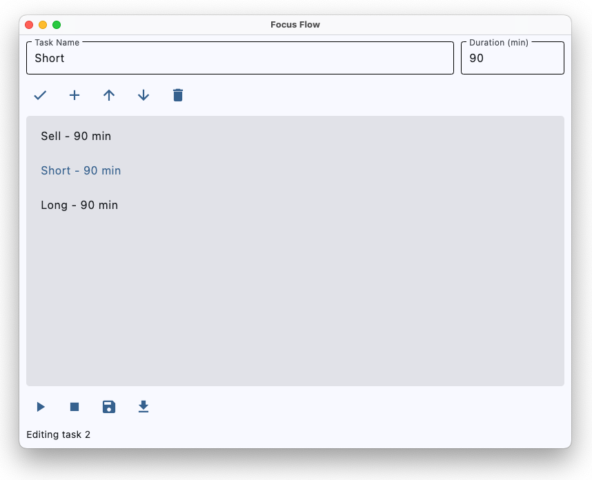

# FocusFlow

**FocusFlow** is a native Python app that helps you rotate through a list of tasks on a timer. Perfect for managing your attention span, or at least pretending to.



## Features

- Create, edit, and delete tasks (aka procrastinate responsibly)
- Custom task order with rotation
- Timer-based transitions with auto-switch
- Option to extend task duration manually
- Persistent task storage via JSON (no database, no problem)
- Built with [CustomTkinter](https://github.com/TomSchimansky/CustomTkinter) for a modern GUI

## Installation

You should use [`uv`](https://github.com/astral-sh/uv) with this project. Here's how to get started:

```bash
uv venv
uv sync
source .venv/bin/activate  # or .venv\\Scripts\\activate on Windows
```

## Run
```bash
uv run main.py
```